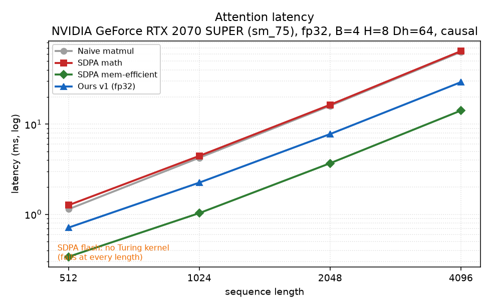
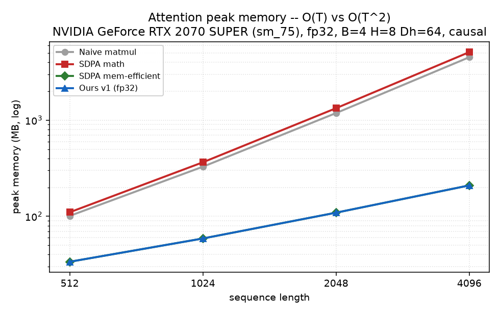
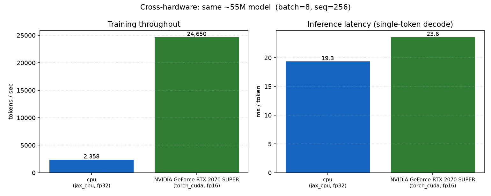
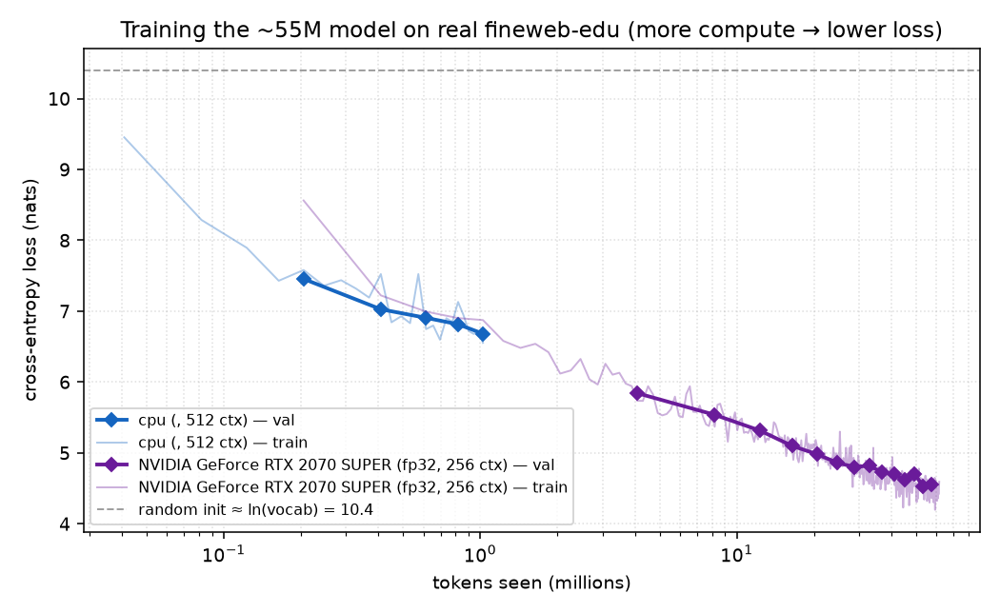

# JaxFormer

A from-scratch decoder-only language model with a hand-written CUDA attention kernel,
built to exercise the full stack a modern LM team touches: a JAX/Flax training pipeline
designed for TPU data-parallelism, a byte-for-byte PyTorch mirror of the same model, a
custom fused-attention CUDA kernel for a consumer Turing GPU, and an honest benchmark
suite tying them together across TPU, GPU, and CPU.

The model doesn't need to write Shakespeare. The point is the engineering: the training
pipeline, the kernel, and the measurement.

---

## What's here

| Component | Where | Status |
|---|---|---|
| Decoder-only transformer (RMSNorm, RoPE, SwiGLU, tied embeddings), ~55M params | `jaxformer/model.py` | done, 13 tests |
| Data-parallel training (Optax, grad-accum via scan, Orbax ckpt, 8-device sharding) | `jaxformer/{train,sharding}.py` | done, 14 tests |
| Byte-level BPE + memmapped uint16 token-shard pipeline | `jaxformer/{tokenizer,data}.py` | done, 19 tests |
| KV-cache autoregressive sampling | `jaxformer/sample.py` | done, 16 tests |
| PyTorch mirror + Flax↔PyTorch numerical parity | `torch_ref/` | done, parity max-abs **1e-6** |
| **CUDA attention kernel v1** (fp32, tiled, online softmax, causal skip) | `kernels/` | done, correct to **1e-6**, 18 tests |
| **CUDA attention kernel v2** (fp16 WMMA tensor cores) | `kernels/` | done, correct to **1e-3**, 22 tests |
| Attention benchmark vs PyTorch SDPA backends (fp32 + fp16) | `bench/bench_attention.py` | done |
| Nsight Compute profiling of both kernels | `bench/profile_*.{py,bat}` | done |
| Cross-hardware training/inference benchmark (CPU + GPU; TPU via notebook) | `bench/bench_training.py` | done |

**68 tests** pass on the dev machine; **40 kernel tests** pass on the GPU box.

---

## The kernel: streaming-softmax attention on Turing

The kernel computes causal multi-head attention without ever materializing the T×T
score matrix. Each thread block streams over key/value tiles keeping a running softmax
— a row max `m` and denominator `l` — and rescales its output accumulator as the max
moves:

```
for each key tile:
    s      = scale · (q · kᵀ)              # this tile's scores
    m_new  = max(m, rowmax(s))
    p      = exp(s − m_new)
    l      = l · exp(m − m_new) + sum(p)   # rescale old denominator, add new
    acc    = acc · exp(m − m_new) + p · v  # rescale old output, add new
    m      = m_new
out = acc / l
```

Memory is therefore **O(T) per query row instead of O(T²)** — the entire reason to write
this rather than `matmul → softmax → matmul`. Causal masking is a *structural skip*:
key tiles are visited in order, so once a tile starts past the query tile's last row the
loop breaks, removing ~half the work at long sequence lengths.

### Why write one at all — the Turing constraint set

The target GPU is an **RTX 2070 Super (Turing, sm_75, 8 GB, 448 GB/s)**, and its
limitations shaped every decision:

- **FlashAttention-2 does not build for Turing** — it requires Ampere (sm_80+). So the
  framing is not "reimplement FA2"; it's "FA2 doesn't support this GPU, so here is a
  kernel that does."
- **PyTorch SDPA's flash backend fails on this GPU** at every sequence length
  (`No available kernel`) — a measured finding, below, not a footnote.
- **No bf16 tensor cores on Turing**, so local training is fp16 + loss scaling (the TPU
  path uses bf16). **No `cp.async`**, and 64 KB shared memory per block — most
  FlashAttention tutorial code assumes Ampere pipelining and won't compile here.

---

## Benchmark: the custom kernel vs PyTorch's attention paths

RTX 2070 Super, causal, B=4 · H=8 · head_dim=64, CUDA-event timing (median of 100 after
warmup), validated against the mem-efficient backend before timing. Data:
`bench/results/attention_AKPC.json`.

| seq | naive | SDPA math | SDPA mem-eff | SDPA flash | **ours v1** |
|----:|------:|----------:|-------------:|:----------:|------------:|
| 512  |  1.14 ms |  1.26 ms | **0.34 ms** | ✗ fails | 0.71 ms |
| 1024 |  4.24 ms |  4.45 ms | **1.03 ms** | ✗ fails | 2.25 ms |
| 2048 | 15.99 ms | 16.39 ms | **3.69 ms** | ✗ fails | 7.76 ms |
| 4096 | 63.10 ms | 64.48 ms | **14.14 ms** | ✗ fails | 29.20 ms |
| **peak mem @4096** | 4.5 GB | 5.1 GB | **210 MB** | — | **210 MB** |




Three honest findings:

1. **SDPA's FlashAttention backend fails on Turing at every length** — the headline the
   whole project is framed around.
2. **The online-softmax memory win is real and matches production**: ours and SDPA
   mem-efficient both stay flat at ~210 MB across the sweep, while naive and SDPA-math
   materialize the T×T scores and balloon to ~5 GB at T=4096.
3. **Speed is an honest middle**: ours is **~2× faster than naive/SDPA-math** at every
   length, and **~2.1× slower than the hand-optimized mem-efficient kernel**. That gap
   is the point of the profiling pass below — and what a v2 would close.

---

## Profiling drove every optimization — with measured deltas

This is the part that separates the kernel from a blog-post reimplementation: every
change was chosen from an `ncu` (Nsight Compute) profile, and every change is backed by a
before/after number.

**v1's profile** (`bench/results/ncu_v1_2048.json`) said it was occupancy-bound:

| metric | value | reading |
|---|---:|---|
| achieved occupancy | **12.3%** | the bottleneck |
| registers / thread | **164** | the cause: each thread holds q[64] + accumulator[64] in registers |
| DRAM throughput | **1.5%** | **not** memory-bound — latency/occupancy-bound |

So **v2** moved the accumulators into `nvcuda::wmma` tensor-core fragments (sm_75
`m16n16k16`) and loaded Q/K/V straight from global. That did exactly what the profile
predicted — **registers/thread 164 → 64, occupancy 12% → 27%** — but the first version was
*slower than v1*, and its profile said why: **552M shared-memory bank conflicts** and
tensor cores **0.6% utilized**. The root cause was exact: the softmax's output
accumulator `Os[row*64 + d]` has row stride 64 ≡ 0 (mod 32), so all 16 active rows collide
on one bank — a 16-way conflict.

**The fix is one line — pad the row stride to 65 — and the delta is measured**
(`bench/results/ncu_v2_2048.json`):

| metric | v2 naïve | v2 padded | change |
|---|---:|---:|---:|
| shared store bank conflicts | 552M | 46M | **12× fewer** |
| shared load bank conflicts | 656M | 148M | 4.4× fewer |
| SM throughput | 8.2% | 27.9% | 3.4× |
| kernel time (T=2048) | 45.3 ms | 13.3 ms | **3.4× faster** |

**The honest outcome:** v2 is 3.4× faster than the naïve tensor-core version, but it still
does *not* beat the tuned SIMT v1 or the production mem-efficient kernel. Even after the
fix, tensor-core utilization is only ~2% — the serial per-row online-softmax between the
two matmuls (16 of 32 lanes, scalar shared reductions) now dominates. **Tensor cores
accelerate the matmuls, but attention is not only matmuls**; closing the remaining gap
needs warp-shuffle softmax reductions and K/V reuse across the key loop (a v3). That
lesson — and the profiler evidence for it — is the point, more than a leaderboard number.

---

## Cross-framework parity — why the comparison is allowed to exist

Comparing "JAX on TPU" against "PyTorch on GPU" is meaningless unless it is the *same
model*. `torch_ref/parity.py` loads one set of weights into both the Flax and PyTorch
implementations and checks the logits agree — **max abs 1e-6**, well under the 1e-4 bar.
The loader is strict (a mis-mapped weight raises rather than silently staying at its
random init), and it handles the conventions that differ: Flax `Linear` kernels are
`(in, out)` and transpose to torch's `(out, in)`; RMSNorm's parameter is `scale` in Flax
and `weight` in torch. Without this check every number in the benchmark table would be
comparing two different networks.

---

## Cross-hardware: the same model on CPU, GPU, and TPU

The same ~55M architecture (parity-verified across frameworks) measured for training
throughput, single-token inference latency, and peak memory — each target in its native
precision. `bench/bench_training.py`; the TPU row comes from the identical `run_jax()` on
a Kaggle TPU host via `notebooks/kaggle_tpu_train.ipynb`.

| target | precision | train tokens/s | infer ms/token | peak mem |
|---|---|---:|---:|---:|
| M4 Pro CPU (JAX) | fp32 | 2,358 | 19.3 | 4.2 GB¹ |
| RTX 2070 Super (PyTorch) | fp16 | **24,650** | 23.6 | 2.1 GB² |
| TPU v5e-8 (JAX) | bf16 | *run the notebook* | | |



Two findings worth stating: the GPU trains **~10× faster** than the CPU, as expected — but
**inference latency is essentially identical**, because single-token decode is
latency-bound (kernel launch, batch of 1), so the GPU's parallelism barely helps at serve
time. Training throughput and serving latency are different problems. (¹ process RSS,
² CUDA allocator — the two memory columns are measured differently and not directly
comparable.)

---

## Does it learn?

Two real runs on the real fineweb-edu shards — a CPU smoke (`scripts/train_smoke.py`,
JAX, ~1M tokens) and a full local GPU run (`torch_ref/train_loop.py`, RTX 2070 Super,
fp32, **15,000 steps / ~61M tokens / 68 min at 15k tok/s**). Plotted against tokens seen:



Both descend along the same trajectory from the `ln(vocab) ≈ 10.4` random-init line — a
nice consistency check that the two independent framework paths learn the same way — and
the GPU run pushes 60× deeper, from **8.6 → val 4.5**. Grad norms stay ~1, the
warmup→cosine schedule behaves, and the run is checkpointed/resumable.

What 4.5 nats looks like — samples from the step-15000 checkpoint
(`scripts/gen_sample.py`, `docs/sample_generations.txt`):

> **The history of** the land is a very important part of the modern world. The history
> of the land is very different from that of the land of the land of England …

> **Scientists have discovered** which makes the discovery possible. It's clear that the
> discovery of a new gene is far from being done. So how do scientists … study the DNA …

Fluent, grammatical, topically-relevant English in the fineweb-edu web register — with
the repetition typical of a small, undertrained model. Coherent long-range meaning needs
the 3.2–3.6 nat range, i.e. the full 1.1B-token run (the Kaggle TPU job). But the model
demonstrably learns real language end to end.

Two bugs surfaced *only* by running real training, not by the 68 unit tests — a useful
reminder that tests and a training run check different things:
a fresh PyTorch model used the wrong (kaiming, not GPT-0.02) weight init, giving a
~200-nat start; and the tied-embedding logits overflowed fp16. Both fixed, the first with
a regression test.

---

## Architecture, and the reasons

| Choice | Reason |
|---|---|
| RMSNorm, pre-norm, RoPE, SwiGLU, tied embeddings, no biases | The modern decoder recipe; RoPE lets attention benchmarks extrapolate past the 1024 training context. |
| Own 32k byte-level BPE (not GPT-2's 50k) | At d_model=512, a 50k vocab puts ~45% of params in the embedding table. 32k also fits `uint16`, halving the corpus on disk to ~2.2 GB — what makes the Kaggle upload practical. |
| Flax **NNX** over linen | So the PyTorch mirror can be near line-for-line, which is what makes the parity test legible enough to trust. |
| Gradient accumulation via `jax.lax.scan` | Flat HLO and bounded peak memory versus an unrolled loop. |
| Sharding developed on **8 simulated CPU devices** | The `jit(in_shardings=…, out_shardings=…)` step is validated on the laptop before any TPU quota is spent; a sharded step is asserted equal to a single-device step. |
| Kernel head_dim = 64 | The tile width the CUDA kernel is designed around. |

Full parameter budget: 12 layers × (4·512² attention + 3·512·1408 SwiGLU) + 32768×512
tied embedding = **55,325,184 params**, matching the analytic count exactly.

---

## Running it

```bash
# Dev machine (CPU/TPU side)
pip install -e ".[data,dev]"
pytest -q                              # 68 tests

# Parity (needs the optional torch extra)
python -m torch_ref.parity             # PASS at max_abs ~1e-6

# Charts from committed benchmark data
python -m bench.plots
```

The GPU/kernel side runs on a Windows box with an RTX 2070 Super. Its toolchain is
non-standard — a hand-assembled CUDA toolkit (the monolithic installer force-bundles a
driver older than the installed one) and torch pinned to 2.8.0+cu128 — all documented in
[`docs/windows_gpu_setup.md`](docs/windows_gpu_setup.md).

```bash
# On the GPU box, with the environment sourced:
python -m kernels.test_correctness     # 40 tests (v1 + v2) vs a float64 reference
python -m bench.bench_attention        # the table above
```

---

## Honest limitations

- **Neither custom kernel beats the production mem-efficient backend.** v1 (fp32) is ~2×
  behind it; v2 (fp16 tensor cores) is behind v1 because the per-row softmax glue between
  the matmuls dominates once the matmuls are on tensor cores. The profiling sections above
  say exactly why, with numbers, and name the v3 direction (warp-shuffle softmax + K/V
  reuse). The kernels are correct and profiler-optimized, not state-of-the-art — which is
  the honest state of a hand-written kernel against a vendor-tuned one.
- **No run to the 3.2–3.6 nat target yet.** The model is trained to val loss ~4.5 on ~61M
  tokens (above) — clearly learning, but undertrained relative to its 1.1B-token
  Chinchilla point. The full run (upload the prepared corpus to Kaggle, ~9 h TPU session)
  is future work; the pipeline, sharding, checkpointing, and parity that make it
  trustworthy are done and tested, and the corpus is prepared.
- **The local GPU run is fp32/seq-256, not fp16.** The parity model uses naive O(T²)
  attention, which is memory-heavy at seq 512 on 8 GB and fp16-unstable there; fp32/seq-256
  trains stably at 15k tok/s. Swapping the custom fused kernel in for training (not just
  benchmarking) is the natural bridge between the two halves of this project.

---

## Repository layout

```
jaxformer/     JAX/Flax training pipeline (model, sharding, train, data, tokenizer, sample)
torch_ref/     PyTorch mirror + Flax↔PyTorch parity
kernels/       CUDA attention kernels v1 (fp32) + v2 (fp16 WMMA), build.py, correctness tests
bench/         attention + profiling harnesses, committed results/, plots
docs/          windows_gpu_setup.md, figures/
tests/         68 tests (model, training, data, sampling, parity)
```
